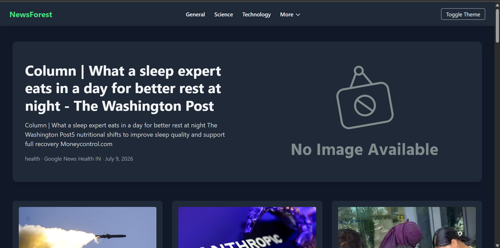
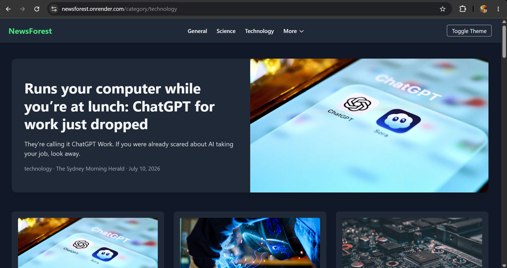

# 🌲 NewsForest

NewsForest is a responsive news web application that delivers the latest headlines across multiple categories using the Mediastack News API. It features a clean, modern UI with dark mode support, category-based browsing, and graceful handling of missing images.

## 🚀 Live Demo

**Website:** *(Add your Render URL after deployment)*

Example:
```
https://newsforest.onrender.com
```

---

## ✨ Features

- 📰 Latest news headlines
- 🌍 India-focused news feed
- 📂 Category-wise browsing
  - General
  - Technology
  - Science
  - Business
  - Health
  - Entertainment
  - Sports
- 🌙 Dark/Light theme toggle
- 📱 Fully responsive design
- 🖼️ Automatic fallback images for missing or broken news images
- 🔗 Open articles in a new tab
- ⚡ Server-side rendering with EJS

---

## 🛠️ Tech Stack

### Frontend
- HTML5
- Tailwind CSS
- EJS

### Backend
- Node.js
- Express.js

### API
- Mediastack News API

### Other Packages
- Axios
- Dotenv

---

## 📁 Project Structure

```
NewsForest/
│
├── public/
│   ├── images/
│   └── ...
│
├── views/
│   ├── main.ejs
│   └── cats.ejs
│
├── app.js
├── package.json
├── package-lock.json
├── .gitignore
└── README.md
```

---

## ⚙️ Installation

Clone the repository

```bash
git clone https://github.com/Priyanshu251625/NewsForest.git
```

Navigate into the project

```bash
cd NewsForest
```

Install dependencies

```bash
npm install
```

Create a `.env` file

```env
MEDIASTACK_API_KEY=YOUR_API_KEY
```

Start the server

```bash
npm start
```

Open your browser

```
http://localhost:3000
```

---

## 🔑 Environment Variables

Create a `.env` file in the root directory.

```env
MEDIASTACK_API_KEY=YOUR_API_KEY
```

You can obtain a free API key from:

https://mediastack.com/

---

## 📸 Screenshots

### Home Page

<p align="center">
  
</p>

<p align="center">
  
</p>

### Category Page

<p align="center">
  
</p>

<p align="center">
  
</p>

---

## 🔮 Future Improvements

- Search news articles
- Infinite scrolling / pagination
- Bookmark favorite articles
- User authentication
- Save dark mode preference
- Filter by country
- Keyword search
- Loading skeletons
- Share articles

---

## 👨‍💻 Author

**Priyanshu Rajhans**

GitHub:
https://github.com/Priyanshu251625

LinkedIn:
https://www.linkedin.com/in/priyanshu-rajhans-961233324/

---

## 📜 License

This project is licensed under the MIT License.
